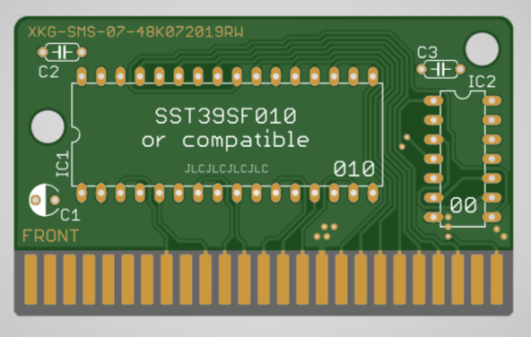
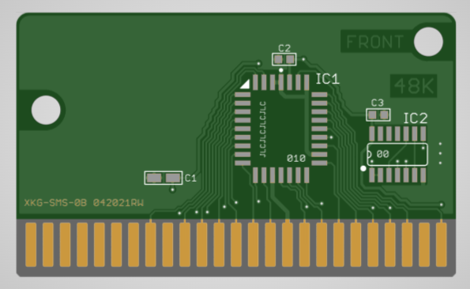
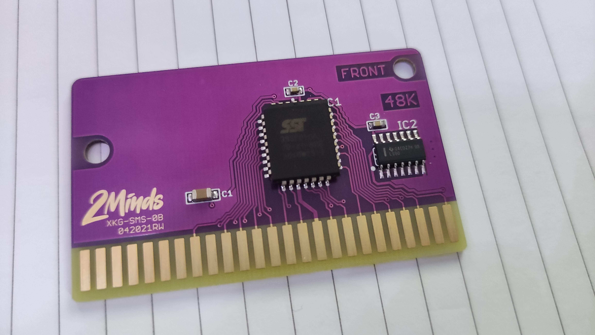
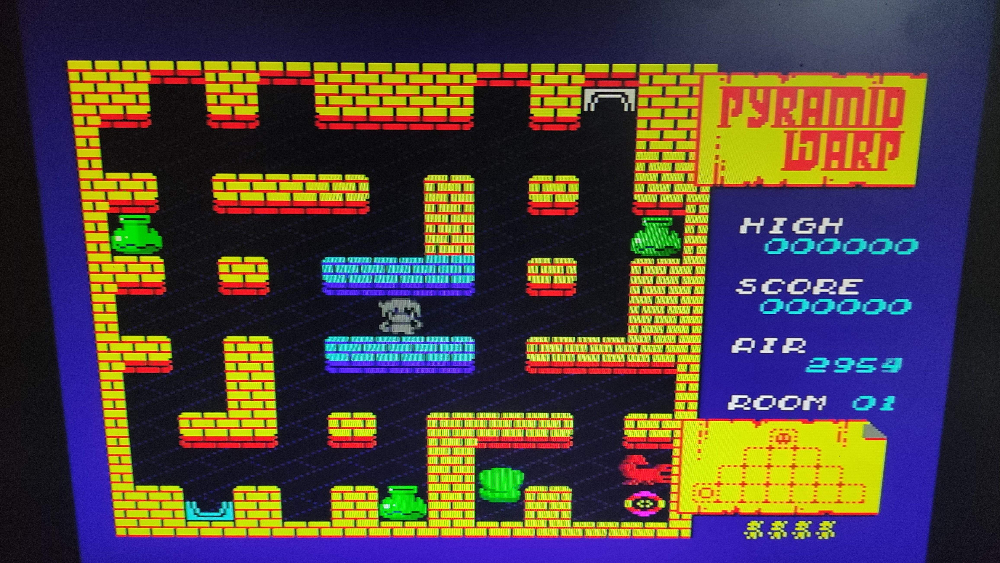

# SMS-simple-48kB-cartridge
<h2>Master System repro 48kB, in DIP and PLCC format</h2>

2 versions, DIP (through hole, easy to solder) and PLCC
BRD files for Eagle, Kicad users or by Oshpark manufacturer.

 

<strong>COMPONENTS</strong>

for DIP pcb:
* 1x SST39SF010 (128k flash) or compatible DIP 32 -compare pinout !-
* 1x 74LS00 or 74HCT00 DIP (DIL14)
* 1x polarized capacitor 10, 22 or 47uF, 16v, 2.54mm
* 2x ceramic capacitors 100nf, 50v, 5mm

for PLCC pcb:
* 1x SST39SF010 (128k flash) or compatible PLCC -compare pinout !-
* 1x 74LS00 or 74HCT00 SOIC (SO14)
* 1x tantalum (or ceramic) capacitor 10, 22 or 47uF, 10v to 50v, 1632 or 3216
* 2x ceramic capacitors 100nf, 50v, 0603
- for an easy soldering, buy/use a stencil + solder paste.
PLCC packages are not really made for hand soldering.

<strong>Why flash component ?</strong> 
because originally, my pcb are (re)writable with my SMSdumper.

Gerbers files are made for JLC,
but are certainly compatible with others manufacturers
(files are ± standard)
1. Go on https://jlcpcb.com
2. Use Instant Quote button
3. Upload the ZIP file containing gerber files
4. Choose how many boards, color and finition

* PCB Qty : Choose your quantity
* PCB Thickness : 1.6mm
* PCB Color : Choose your color, but can impact the price when finition is not HASL (with lead)
* Surface Finish : Chose the finition, HASL is tin (basic) and ENIG is gold (best)
* Mark on PCB : Order number (specify position) (will be under the component)

<h3>Some pics</h3>
 

Cheers,
ICHIGO
